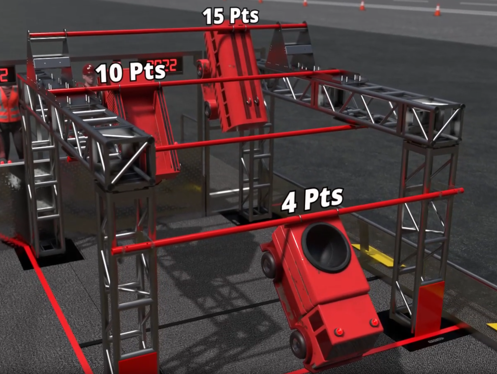

> A good competitor knows to memorize and follow all rules of the competition.
> A great competitor dedicates unfathomable amount of their energy to get ahead by finding loopholes in the rules.

<!--more-->

## The Premise

The [FIRST Robotics Competition](https://www.firstinspires.org/robotics/frc) is, in my humble opinion the pinnacle of high school robotics competitions in the world.
Every year a new rule set is released, and groups of fnatic high school robot lovers need to figure out how to build the best robot possible in say 6-8 weeks.

Now you might be thinking, how complex can rules for a high school robotics competition be?
Well, the [2024 FRC Game Manual](https://firstfrc.blob.core.windows.net/frc2024/Manual/2024GameManual.pdf) is a plesant 153 pages long. Say 300-400 words per page at an average reading speed
of 300 words per miniute, it will take around 2.5-3.5 hours to give it a once over.

So how did these energy drink fueled high schoolers skirt around them rules, and more importantly how are any of these related to computer algorithms? Let me explain.

## The Problem To Solve

In FRC's 2022 competiton [Rapid React](https://www.youtube.com/watch?v=LgniEjI9cCM), toward the end of each match robots gain extra points if it can climb and be suspended from a series of rungs.
Of course, the higher the rung, the more points it earns.

The rungs' distance from the ground are as follows:
- 7ft 7
- 6ft 3
- 5 ft
- 4 ft

The problem however, lies in the following requirements:
> A robot may not be more than 4ft 4inch tall in the standard profile, and can not extent more than 16 inches beyond the profile.
> -- <cite>2022 FRC Competition Game Manual[^1]<cite>

[^1]: The above is excerpted from [2022 FRC Competition Game Manual](https://firstfrc.blob.core.windows.net/frc2022/Manual/2022FRCGameManual.pdf), section 9, Robot Construction Rules

This means the highest rung a robot can legally reach from the ground is the second lowest, and the robot must proceed rung by rung to score the most amount of points.
Let's now take a look at a couple common solutions.

## The Orthodox Approaches

### Two Pairs

The simplest and most brute force answer is to use two pair of arms.
Have one of them piviot such that the robot can climb up to a rung and reach for the next one.

This approach requires two separate sets of arms to climb each individual rung once.
If it is an algorithm its run time will be 2\*n, which is still O(n).

### Bicycle Crank

This is an improvement of the approach above.
Instead of having two pairs of arms playing catch up, using a bicycle crank like structure allow the robot to climb up the rungs with significantly greater effiency.

By not having two sets of arms, this climbing mechanism only need to iterate over the rungs once instead of twice. Making it an optimized O(n).

## The Great Competitors

### What's Not In The Rule Book

Some of the teams read the rulebook carefully, and found out there are no rules prohibiting the robot from contacting the rest of the structure while climbing the rungs.

And they did just that! With an additional mechanism to push against the structure holding the rungs, these teams were able to skip the rungs in the middle and go straight to the top. Improving O(n) to O(log(n)).

### How Would A Human Do It?
But if you thought that's the craziest method to climb to the highest rung you would be dead wrong.
See a typical human is not tall enough to reach the monkey bars at the park, but we can make it up anyways.

How did we do it? That's right, we jumped.

This is it, the fastest way to the top. This is O(1).

